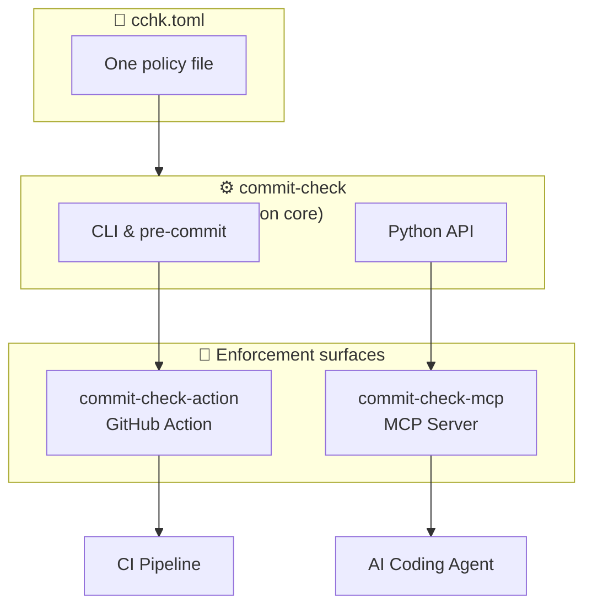

---
hide:
  - toc
---

# Projects

The commit-check ecosystem is built on a simple architecture: **one policy engine,
multiple enforcement surfaces.** Write your `cchk.toml` once — every surface
reads the same file.

| Surface | What it does | Get started |
|---------|-------------|-------------|
| **commit-check** | CLI tool, pre-commit hooks, and Python library. The core engine that runs all validations. | [`commit-check/commit-check`](https://github.com/commit-check/commit-check) |
| **commit-check-action** | GitHub Action wrapping the core engine. Posts results as check runs, job summaries, and PR comments. | [`commit-check/commit-check-action`](https://github.com/commit-check/commit-check-action) |
| **commit-check-mcp** | MCP server that exposes validations as structured tools for AI coding agents (Claude Code, Cursor, Copilot, etc.). | [`commit-check/commit-check-mcp`](https://github.com/commit-check/commit-check-mcp) |
