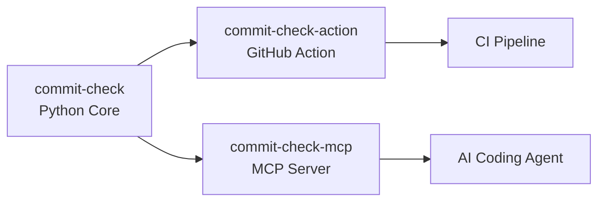

---
hide:
  - toc
---

# Projects

The Commit Check ecosystem consists of three open-source projects that work
together to enforce commit quality standards across your entire workflow.

-   :fontawesome-brands-python: __commit-check__

    ---

    **The core engine.** A Python CLI and library for validating commit
    messages, branch names, author identity, sign-off trailers, push safety,
    and AI attribution.

    - Latest release: **v2.11.0**
    - Highlights: AI attribution governance, message patterns, JSON output,
      Python API
    - Works as: CLI tool, pre-commit hooks, importable library

    [:octicons-arrow-right-24: GitHub](https://github.com/commit-check/commit-check)
    [:octicons-arrow-right-24: Docs](https://commit-check.github.io/commit-check/)

-   :material-github: __commit-check-action__

    ---

    **GitHub Action** that wraps the core engine into a seamless CI step.
    Validates PR commits and posts results as check runs, job summaries, and
    PR comments.

    - Latest release: **v2.10.0**
    - Highlights: Windows runner support, PR title validation, PR comments
    - Works as: GitHub Action in your workflows

    [:octicons-arrow-right-24: GitHub](https://github.com/commit-check/commit-check-action)
    [:octicons-arrow-right-24: Docs](https://github.com/commit-check/commit-check-action?tab=readme-ov-file#usage)

-   :material-robot: __commit-check-mcp__

    ---

    **MCP Server** that exposes commit-check validations as structured tools
    for AI coding agents like Claude Code, Cursor, and Copilot.

    - Latest release: **v0.1.7**
    - Highlights: AI attribution governance sync, message pattern support,
      push safety validation, MCP Registry published
    - Works as: MCP server in your AI agent's config

    [:octicons-arrow-right-24: GitHub](https://github.com/commit-check/commit-check-mcp)
    [:octicons-arrow-right-24: MCP Registry](https://registry.mcpx.dev)

## How they fit together

The same `cchk.toml` policy file drives **all three** — write it once, enforce
it everywhere.

## Release history

| Project | Latest | Recent updates |
|---------|--------|----------------|
| commit-check | v2.11.0 | AI attribution governance, message patterns, JSON output |
| commit-check-action | v2.10.0 | Windows runner, PR title validation |
| commit-check-mcp | v0.1.7 | AI attribution sync, message patterns, MCP Registry |

## Quick links

| What do you need? | Use this |
|-------------------|----------|
| Validate commits in CI | [commit-check-action](https://github.com/commit-check/commit-check-action) |
| Validate commits locally | [commit-check CLI](https://github.com/commit-check/commit-check) |
| Validate commits via pre-commit | [commit-check hooks](https://commit-check.github.io/commit-check/example.html#running-as-pre-commit-hook) |
| Let AI agents auto-comply | [commit-check-mcp](https://github.com/commit-check/commit-check-mcp) |
| Configure policy once | [`cchk.toml` reference](https://commit-check.github.io/commit-check/configuration.html) |
